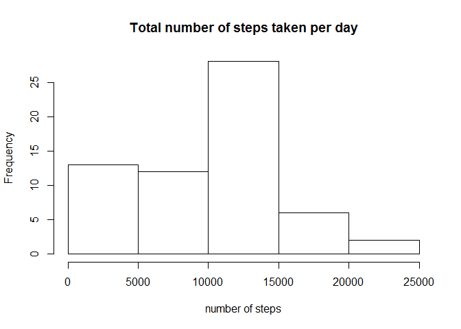
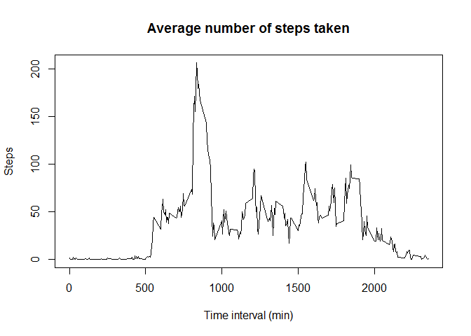
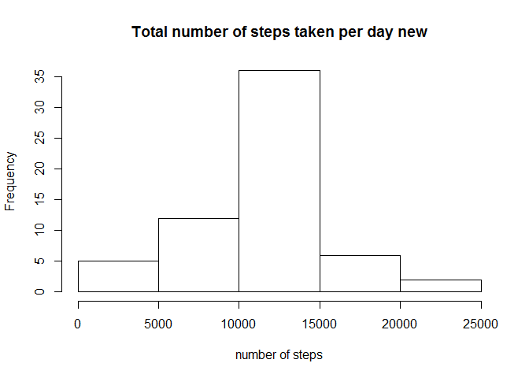
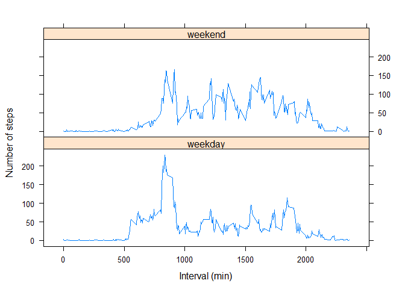

# Reproducible Research: Peer Assessment 1


## Loading and preprocessing the data


```r
data <- read.csv(unz("activity.zip", "activity.csv"))
```

## What is mean total number of steps taken per day?

1. Calculate the total number of steps taken per day


```r
stepsum <- tapply(data$steps, data$date, sum, na.rm = TRUE)
```

2. Make a histogram of the total number of steps taken each day


```r
hist(stepsum, xlab = "number of steps", main = "Total number of steps taken per day")
```

 

3. Calculate and report the mean and median of the total number of steps taken per day


```r
mean(stepsum)
```

```
## [1] 9354.23
```

```r
median(stepsum)
```

```
## [1] 10395
```

## What is the average daily activity pattern?

1. Make a time series plot of the 5-minute interval and the average number of steps taken, averaged across all days


```r
stepmean <- tapply(data$steps, data$interval, mean, na.rm = TRUE)
meandata <- cbind(data[1:288,3], stepmean)
colnames(meandata) <- c("interval", "stepmean") 
plot(meandata, type="l", xlab="Time interval (min)", ylab="Steps", main="Average number of steps taken")
```

 

2. Which 5-minute interval, on average across all the days in the dataset, contains the maximum number of steps?


```r
meandata[which.max(meandata[,2]),]
```

```
## interval stepmean 
## 835.0000 206.1698
```

## Imputing missing values

1. Calculate and report the total number of missing values in the dataset 


```r
library(plyr)
sum(is.na(data))
```

```
## [1] 2304
```

2&3. Filling in all of the missing values in the dataset with the mean for that 5-minute interval and create a new dataset.


```r
newdata <- ddply(data, .(interval), transform, steps=ifelse(is.na(steps), mean(steps, na.rm=TRUE), steps))
```

4. Make a histogram of the total number of steps taken each day and Calculate and report the mean and median total number of steps taken per day.


```r
stepsumnew <- tapply(newdata$steps, newdata$date, sum)
hist(stepsumnew, xlab = "number of steps", main = "Total number of steps taken per day new")
```

 

```r
mean(stepsumnew)
```

```
## [1] 10766.19
```

```r
median(stepsumnew)
```

```
## [1] 10766.19
```

These values differ from the estimates from the first part of the assignment.The impact of imputing missing data on the estimates of the total daily number of steps is to minimize the bias caused by missing values.

## Are there differences in activity patterns between weekdays and weekends?

1. Create a new factor variable in the dataset with two levels - "weekday" and "weekend".


```r
library(lubridate)
```

```
## 
## Attaching package: 'lubridate'
## 
## The following object is masked from 'package:plyr':
## 
##     here
```

```r
dates <- ymd(newdata$date)
day <- weekdays(dates)
for (i in 1: length(day)) {
  if (day[i]=="Saturday" | day[i]=="Sunday") {
    day[i] <- "weekend"} 
  else {day[i] <- "weekday"}
}
newdata2 <- cbind(newdata, day)
```

2. Make a panel plot containing a time series plot of the 5-minute interval (x-axis) and the average number of steps taken, averaged across all weekday days or weekend days.


```r
library(lattice)
x <- ddply(newdata2, .(interval, day),summarise, mean = mean(steps))
xyplot(mean~interval|day, data=x, type="l", xlab="Interval (min)", ylab="Number of steps", layout=c(1,2))
```

 
